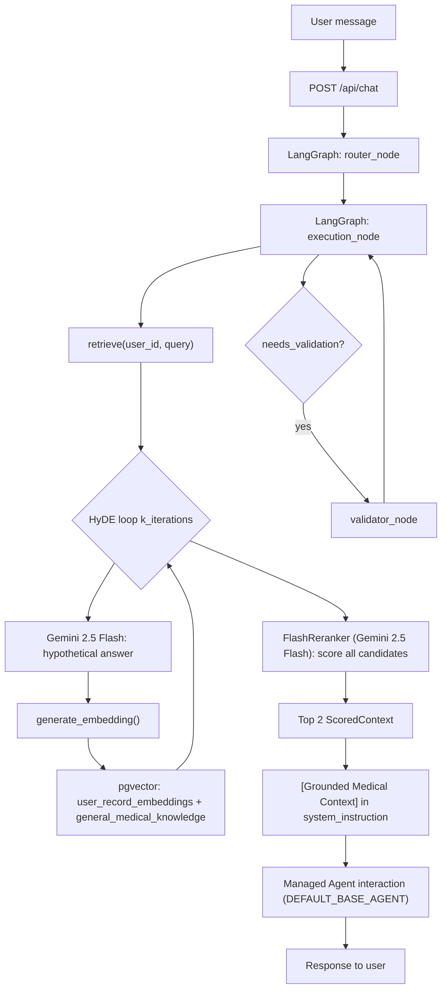

# google-io-mediagent

> [!IMPORTANT]
> **New to the codebase?** Read the [**SETUP_GUIDE.md**](./SETUP_GUIDE.md) first. It is the "Bible" for getting this project running from scratch.

A Domain-Driven Design (DDD) platform for managed agents: FastAPI + LangGraph backend, Next.js frontend, optional Telegram bot, and standalone research agents.

## Architecture

| Component | Stack | Role |
|-----------|--------|------|
| **Backend** | FastAPI, LangGraph, pgvector | Agent registry, chat orchestration, ingestion, interpreter, check-ins |
| **Frontend** | Next.js, Tailwind v4, shadcn/ui | Chat UI and agent management |
| **Database** | PostgreSQL + pgvector | Health records, embeddings, demo data |
| **Telegram** | python-telegram-bot | File understanding and API bridge (optional) |
| **Research agent** | Gemini + public medical APIs | Standalone medical RAG prototype |

Domain code lives under `backend/app/domains/` (for example `agent_registry`, `orchestration`, `ingestion`, `telegram`, `agents/research_agent`).

---

## Four-agent roadmap

The platform now has four specialized agent packages under `backend/app/domains/agents/`. Research and deep insights are the fuller pipelines; scans and reports are intentionally hackathon-safe v1 agents that use simple text-only pgvector retrieval over patient records.

| Agent | Status | Where it lives today |
|-------|--------|----------------------|
| **Research** | Packaged | `backend/app/domains/agents/research_agent/` — public APIs (RxNorm, MedlinePlus, DailyMed, openFDA, MeSH) + Gemini synthesis |
| **Deep insights** | Packaged | `backend/app/domains/agents/deep_insights_agent/` — wraps `domains/retrieval/` + grounded Managed Agent synthesis; also used by `/api/chat` |
| **Scans** | Packaged | `backend/app/domains/agents/scans_agent/` — text-only search over scan-like extracted summaries; no raw image reread in v1 |
| **Reports** | Packaged | `backend/app/domains/agents/reports_agent/` — one-shot search over lab PDFs and doctor-note style records |

---

## Deep insights agent (standalone)

Location: `backend/app/domains/agents/deep_insights_agent`

Same pipeline as the chat graph: HyDE + pgvector + rerank + grounded Managed Agent answer.

```python
from app.domains.agents.deep_insights_agent.agent import run_deep_insights_agent

print(run_deep_insights_agent("what does my LDL mean?", user_id="<uuid>"))
```

Requires Postgres/pgvector and `GEMINI_API_KEY`. See [backend/app/domains/agents/deep_insights_agent/README.md](./backend/app/domains/agents/deep_insights_agent/README.md).

---

## Scans and reports agents (standalone)

Locations:

- `backend/app/domains/agents/scans_agent`
- `backend/app/domains/agents/reports_agent`

Both agents are deliberately simpler than deep insights:

- **Text only:** they search extracted record summaries already embedded in pgvector.
- **One search:** no HyDE loop and no reranker.
- **Patient records only:** they do not query `general_medical_knowledge`.
- **No DB migration:** filters use current `file_type`, `file_name`, and extracted text heuristics.

```python
from app.domains.agents.scans_agent.agent import run_scans_agent
from app.domains.agents.reports_agent.agent import run_reports_agent

print(run_scans_agent("what does the scan impression say?", user_id="<uuid>"))
print(run_reports_agent("explain my LDL result", user_id="<uuid>"))
```

Implementation notes:

| Agent | Scope | Model default | Retrieval helper |
|-------|-------|---------------|------------------|
| **Scans** | scan-like image/radiology records, excluding check-ins and Rx bottles | `gemini-3.5-flash` with MedGemma-style prompt | `patient_record_text_rag.SCAN_RECORD_FILTER` |
| **Reports** | lab PDFs, reports, doctor/physician notes, excluding check-ins and Rx bottles | `gemini-3.5-flash` | `patient_record_text_rag.REPORT_RECORD_FILTER` |

Future hardening: add a real `record_category` column during ingestion (`scan`, `report`, `rx_bottle`, `checkin`, etc.) and replace the current heuristics with exact filters.

---

## Deep insights agent (pipeline map)

This is the **personal health RAG** path: the user’s question is expanded iteratively, matched against **pgvector** (patient records + general medical KB), reranked, then answered with grounded context.

### End-to-end flow



### Where each step lives

| Step | What happens | File(s) |
|------|----------------|---------|
| **Entry** | Chat request supplies `message`, optional `user_id` | `backend/app/domains/orchestration/router.py` |
| **Orchestration** | `graph.invoke()` runs router → execution → (optional) validator | `backend/app/domains/orchestration/graph.py` |
| **HyDE loop** | For each iteration: Flash generates a hypothetical clinical snippet (conditioned on prior hits) → embed → pgvector search → append to `all_contexts[]` (deduped) | `backend/app/domains/retrieval/services.py` — `retrieve()` |
| **Embeddings** | `gemini` text embedding (768d) for hypothetical text | `backend/app/domains/ingestion/services.py` — `generate_embedding()` |
| **Vector search** | Cosine distance on `user_record_embeddings` (scoped by `user_id`) and `general_medical_knowledge` | SQL in `retrieve()`; schema in `backend/app/core/db_init.sql` |
| **Rerank** | Score relevance (0–10), return **top 2**; v1 uses Flash, MedGemma is a stub | `FlashReranker` / `MedGemmaReranker` in `retrieval/services.py`; types in `retrieval/schemas.py` |
| **Synthesis** | Top-2 chunks injected as `[Grounded Medical Context]`; final answer from **Gemini Managed Agent** (`client.interactions.create`) | `deep_insights_pipeline.py` (`synthesize_grounded_answer`); called from `execution_node` in `orchestration/graph.py` |
| **Citation guard** | Validator + regex check for `[doc:]`, LOINC, RxNorm on medical claims | `validator_node` in `orchestration/graph.py` |
| **Data ingest** | Records chunked and embedded into pgvector (feeds retrieval) | `backend/app/domains/ingestion/` |

### Models and defaults (as implemented)

| Stage | Model / component | Notes |
|-------|-------------------|--------|
| HyDE hypothetical | `gemini-2.5-flash` | Not the raw user query — a synthetic “document-like” answer for better retrieval |
| Reranker | `gemini-2.5-flash` via `FlashReranker` | `MedGemmaReranker` exists but raises `NotImplementedError` (planned Vertex v1.1) |
| Final answer | Managed agent `antigravity-preview-05-2026` (`DEFAULT_BASE_AGENT`) | Set in `backend/app/core/config.py`; not a direct `generate_content` call on Flash/Pro |
| Loop count | **`k_iterations=2`** (default) | Product spec in `project-docs/prd-zoie-v2.md` describes **5** iterations; change via `retrieve(..., k_iterations=5)` |
| Top contexts | **`top_k=2`** (default) | Returned after rerank |

### Public API surface

There is **no** standalone `/api/retrieval` router. Deep insights runs **inside** the chat graph:

- **HTTP:** `POST /api/chat` with `user_id` when querying patient-specific vectors
- **Python (full pipeline):** `from app.domains.agents.deep_insights_agent.agent import run_deep_insights_agent`
- **Python (retrieval only):** `from app.domains.retrieval.services import retrieve`

### Related domains (not the deep-insights loop)

| Domain | Role |
|--------|------|
| `agent_registry/` | CRUD for persisted Managed Agents (UI/agent picker) |
| `ingestion/` | Upload → MedGemma-style extraction → chunk → embed → pgvector |
| `interpreter/` | Separate interpreter turns API |
| `checkins/` | Proactive check-in triggers |
| `grounding/` | LOINC/RxNorm inline lookup helpers |
| `telegram/` | Bot; can call backend APIs but does not own the HyDE pipeline |

### Spec vs code

- **Iterations:** PRD/sprint docs target 5 HyDE rounds; runtime default is **2** (`retrieve` signature in `retrieval/services.py`).
- **Reranker:** Described as MedGemma in architecture docs; shipped implementation is **`FlashReranker`** behind the `MedicalReranker` interface.
- **Synthesis:** Sprint notes mention `gemini-2.5-pro` for final answers; current code uses the **Managed Agent Interactions API** with the configured base agent.

---

---

## 🚀 Getting Started

Please refer to [**SETUP_GUIDE.md**](./SETUP_GUIDE.md) for the full, step-by-step instructions on:
1. Setting up your `.env` and API keys.
2. Launching the `pgvector` database.
3. Installing dependencies and seeding data.
4. Running and testing all 4 specialized agents.

---

---

## Environment setup

1. Copy the root env template:

   ```bash
   cp .env.example .env
   ```

2. Set at least:

   ```env
   GEMINI_API_KEY=your-gemini-api-key
   ```

3. Optional but useful:

   | Variable | Purpose |
   |----------|---------|
   | `TELEGRAM_BOT_TOKEN` | Starts Telegram polling when the backend boots |
   | `POSTGRES_*` | Database connection (defaults match local Docker) |
   | `NEXT_PUBLIC_API_URL` | Frontend → backend URL (default `http://localhost:8000`) |
   | `GCS_BUCKET_NAME` | Cloud storage; omit to use local filesystem |

The Makefile loads `.env` automatically when you run `make dev`, `make docker-up`, etc.

---

## Quick start (local dev)

### 1. Install dependencies

From the repo root:

```bash
make install
```

This creates `backend/venv`, installs Python requirements, and runs `npm install` in `frontend/`.

### 2. Start PostgreSQL (pgvector)

The backend expects Postgres on startup. Easiest option — only the DB container:

```bash
docker compose up db -d
```

Defaults match `.env.example` (`localhost:5432`, database `health_assistant`).

### 3. Run backend + frontend

```bash
make dev
```

| Service | URL |
|---------|-----|
| Frontend | http://localhost:3000 |
| Backend API | http://localhost:8000 |
| OpenAPI docs | http://localhost:8000/docs |
| Health check | http://localhost:8000/ |

### 4. (Optional) Seed demo data

With Postgres running:

```bash
make seed
```

---

## Run components separately

### Backend only

```bash
cd backend
source venv/bin/activate   # or: ../backend/venv/bin/activate from repo root
export GEMINI_API_KEY=...  # if not in .env
uvicorn app.main:app --reload --port 8000
```

Ensure Postgres is up (`docker compose up db -d`) so startup DB initialization succeeds.

**Main API routes**

| Prefix | Description |
|--------|-------------|
| `/api/agents` | Managed agent registry (CRUD) |
| `/api/chat` | LangGraph orchestration / chat |
| `/api/ingest` | Document upload and ingestion |
| `/api/interpreter` | Interpreter turns |
| `/api/checkins` | Check-in triggers |
| `/api/telegram` | Bot status (`GET /api/telegram/status`) |

### Frontend only

```bash
cd frontend
npm run dev
```

Set `NEXT_PUBLIC_API_URL` in `.env` (or `frontend/.env.local`) if the backend is not on `http://localhost:8000`.

### Full stack with Docker

Builds and runs database, backend, and frontend:

```bash
# .env must include GEMINI_API_KEY (and TELEGRAM_BOT_TOKEN if you want the bot)
make docker-up
```

Stop:

```bash
make docker-down
```

---

## Managed agents (main platform)

The web app and `/api/chat` flow use **Gemini Managed Agents** via the agent registry:

1. Open http://localhost:3000 with `make dev` running.
2. Create or select agents in the UI (backed by `/api/agents`).
3. Send messages in chat; the orchestrator routes through LangGraph (`/api/chat`).

Backend configuration (default base agent, API client) is in `backend/app/core/config.py`. Platform customization patterns are documented in [AGENTS.md](./AGENTS.md).

---

## Research agent (standalone)

Location: `backend/app/domains/agents/research_agent`

A prototype that routes queries across public medical sources (RxNorm, MedlinePlus, DailyMed, openFDA, MeSH), retrieves from the two best sources, and synthesizes an answer with Gemini.

**Not clinical decision support** — do not use openFDA alone for care decisions.

### Setup and run

```bash
cd backend/app/domains/agents/research_agent
python3 -m venv .venv
source .venv/bin/activate
pip install -r requirements.txt
cp .env.example .env
# Add GEMINI_API_KEY to .env
python medical_rag.py
```

Wrapper entrypoint:

```bash
python agent.py
```

### Call from Python

From the research agent directory (after `pip install` and `.env`):

```python
from agent import run_research_agent

print(run_research_agent("metformin warnings in adults"))
```

More detail: [backend/app/domains/agents/research_agent/README.md](./backend/app/domains/agents/research_agent/README.md).

---

## Telegram bot

Code: `backend/app/domains/telegram`

### Integrated with the main backend (recommended)

1. Create a bot via [@BotFather](https://t.me/BotFather) and copy the token.
2. Add to root `.env`:

   ```env
   TELEGRAM_BOT_TOKEN=your_bot_token_here
   ```

3. Start the backend (`make dev` or `uvicorn`). Polling starts automatically on startup.
4. Check status: `GET http://localhost:8000/api/telegram/status`

### Standalone bot process

For development without the full API:

```bash
cd backend/app/domains/telegram
python3 -m venv .venv
source .venv/bin/activate
pip install -r requirements.txt
# Configure .env with TELEGRAM_BOT_TOKEN and GEMINI_API_KEY
python main.py
```

Setup guide: [backend/app/domains/telegram/SETUP.md](./backend/app/domains/telegram/SETUP.md).

---

## Makefile reference

```bash
make help          # List all commands
make install       # Backend venv + frontend npm
make dev           # Backend :8000 + frontend :3000
make seed          # Demo data (Postgres required)
make docker-up     # Full Docker stack
make docker-down   # Stop Docker stack
```

Infrastructure targets (`infra-up`, `gcp-auth`, etc.) are for GCP/Pulumi deployment — run `make help` for the full list.

---

## Project layout

```
google-io-mediagent/
├── backend/
│   └── app/
│       ├── main.py              # FastAPI entry
│       ├── core/                # Config, DB, GenAI client, db_init.sql (pgvector)
│       └── domains/
│           ├── agent_registry/  # Managed agent CRUD
│           ├── orchestration/   # LangGraph + /api/chat (deep insights synthesis)
│           ├── retrieval/       # HyDE + rerank (deep insights core)
│           ├── ingestion/       # Upload, embed, pgvector writes
│           ├── agents/
│           │   ├── research_agent/       # Public medical APIs RAG
│           │   ├── deep_insights_agent/  # pgvector HyDE + grounded synthesis
│           │   ├── scans_agent/          # Text-only scan-record RAG
│           │   ├── reports_agent/        # Text-only lab/report RAG
│           │   └── patient_record_text_rag.py
│           ├── telegram/
│           ├── interpreter/
│           ├── checkins/
│           └── grounding/
├── frontend/                    # Next.js UI
├── project-docs/                # PRDs (incl. deep insights / HyDE spec)
├── infra/                       # Pulumi / GCP
├── docker-compose.yml
├── Makefile
└── .env.example
```

---

## Further reading

- [SETUP_GUIDE.md](./SETUP_GUIDE.md) — Full local setup, API keys, DB, seed data, and live agent tests
- [AGENTS.md](./AGENTS.md) — Managed agents customization and DDD conventions
- [backend/app/domains/agents/research_agent/README.md](./backend/app/domains/agents/research_agent/README.md) — Research agent
- [backend/app/domains/agents/deep_insights_agent/README.md](./backend/app/domains/agents/deep_insights_agent/README.md) — Deep insights agent
- [backend/app/domains/agents/scans_agent/README.md](./backend/app/domains/agents/scans_agent/README.md) — Scans agent
- [backend/app/domains/agents/reports_agent/README.md](./backend/app/domains/agents/reports_agent/README.md) — Reports agent
- [project-docs/prd-zoie-v2.md](./project-docs/prd-zoie-v2.md) — Deep insights / HyDE + MEDGemma reranker product spec
- [backend/app/domains/telegram/SETUP.md](./backend/app/domains/telegram/SETUP.md) — Telegram bot setup
