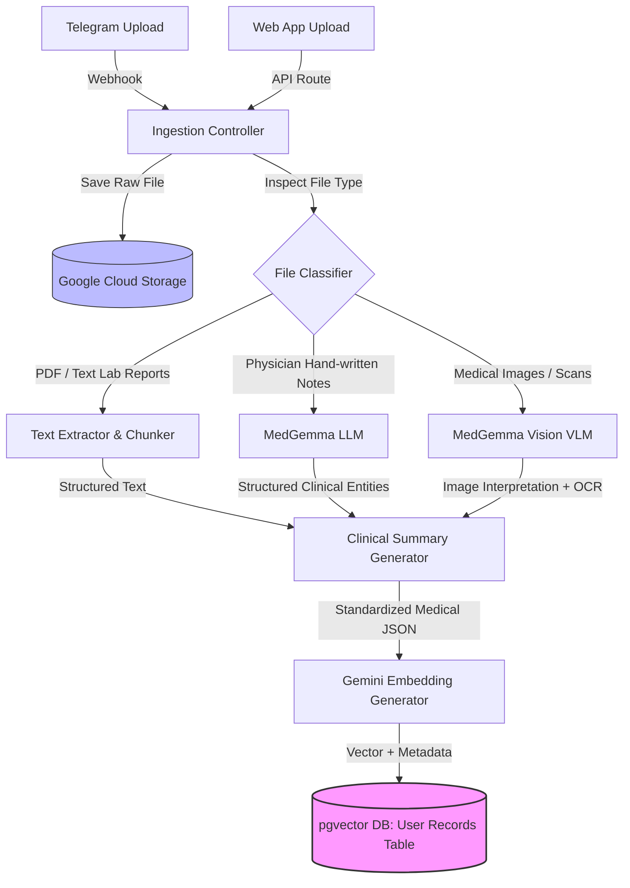
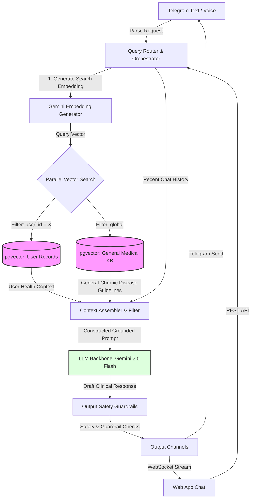

# MediAgent — Product Requirements & Technical Architecture
## Google I/O 2026 Hackathon Submission

**Team:** Team Nebula
**Date:** 2026-05-23

---

## 1. Problem Statement

Patients receive complex medical documents — lab reports, physician notes, diagnostic images — but lack the tools to understand them. Medical jargon creates a barrier between patients and their own health data. Caregivers managing records for elderly relatives face the same gap multiplied.

**The cost:** Patients miss warning signs in their own lab results, fail to track chronic condition trends, and arrive at appointments unable to ask informed questions.

## 2. Solution: MediAgent

A personal health assistant that ingests medical records (PDFs, images, physician notes), translates them into plain language using MedGemma and Gemini, and provides an interactive RAG-powered consultation grounded in the patient's own data.

### Core Differentiators

| Feature | Why It Matters |
|---------|---------------|
| **MedGemma clinical extraction** | Purpose-built medical VLM — not a generic OCR pipeline |
| **Dual RAG (personal + general KB)** | Answers grounded in YOUR records + medical guidelines |
| **Multi-channel access** | Telegram bot for quick uploads, web dashboard for deep analysis |
| **Trend visualization** | See HbA1c, blood pressure, glucose over time — not just individual reports |
| **LangGraph orchestration** | Router → Executor → Validator loop ensures response quality |
| **Production-grade IaC** | Dockerized, deployed to Cloud Run via Pulumi with ESC secrets |

---

## 3. User Personas

### Persona A: Maria — Chronic Patient (Type 2 Diabetes + Hypertension)
- Uploads lab reports every 3 months
- Wants to know: "Is my HbA1c getting better?" / "What does this number mean?"
- Interacts via Telegram (quick photo uploads) and Web App (trend tracking)

### Persona B: David — Caregiver for Elderly Parent
- Batch-uploads discharge summaries and doctor notes
- Wants to know: "What medications is my mother on?" / "What changed since the last visit?"
- Uses Web App to batch-upload documents and review consolidated health history

---

## 4. Functional Requirements

### FR-1: Multimodal Ingestion Pipeline
- **Lab Reports & PDFs**: Extract text, parse tabular data (blood work panels), chunk contents
- **Physician Notes**: Process via MedGemma to extract clinical entities, medications, diagnoses, allergies
- **Medical Images (X-Rays, MRIs, Prescriptions)**: Pass to MedGemma (Vision) for structural descriptions and OCR
- **Embeddings**: Generate 768d vectors via Gemini `text-embedding-004` for all parsed records
- **Storage**: Raw files to Google Cloud Storage, embeddings + metadata to PostgreSQL/pgvector

### FR-2: Vector Storage & Segmentation
- **User-Specific Records**: Stored in user-segregated pgvector table indexed by `user_id`
- **General Knowledge**: Separate global pgvector table with chronic disease guidelines, drug facts, medical literature
- **Isolation**: Queries always constrained by `WHERE user_id = :current_user_id`

### FR-3: Contextual Querying & RAG Orchestration
- Dual semantic search: user's personal records + general medical knowledge base
- Short-term conversation history included in context
- Retrieved context formatted into grounded prompt for Gemini 2.5 Flash backbone
- LangGraph workflow: Router → Execution → Validator with max 3 iteration loop

### FR-4: User Interaction Channels
- **Telegram Bot**: Text messaging, file/image upload, phone number registration
- **Web App**: Dashboard with ingestion zone, timeline, metric trends, chat interface, orchestrator logs
- **Voice Call** (post-hackathon): Twilio/LiveKit WebRTC with STT → RAG → TTS pipeline

---

## 5. Technical Architecture

### 5.1 System Overview

```
User Input (Web / Telegram)
    │
    ▼
┌──────────────────────────┐
│  Google Cloud Storage     │ ← Raw file storage
└──────────┬───────────────┘
           ▼
┌──────────────────────────┐
│  Ingestion Agent          │
│  ├─ File Classifier       │
│  ├─ MedGemma (VLM)        │ ← Medical image/note parsing
│  ├─ Text Chunker          │
│  └─ Gemini Embeddings     │ ← text-embedding-004 (768d)
└──────────┬───────────────┘
           ▼
┌──────────────────────────┐
│  Cloud SQL PostgreSQL     │
│  ├─ pgvector              │ ← user_record_embeddings (HNSW index)
│  ├─ User Records          │ ← metadata + extracted summaries
│  └─ General Med KB        │ ← chronic disease guidelines
└──────────┬───────────────┘
           ▼
┌──────────────────────────┐
│  LangGraph Workflow       │
│  ├─ Router Node           │ ← Gemini determines tools + instructions
│  ├─ Execution Node        │ ← Dual RAG retrieval + Antigravity agent
│  └─ Validator Node        │ ← Quality check loop (max 3 iterations)
└──────────┬───────────────┘
           ▼
     Response to User
```

### 5.2 Data Ingestion Pipeline



### 5.3 Retrieval & Query Pipeline (RAG)



---

## 6. Database Schema (PostgreSQL + pgvector)

```sql
CREATE EXTENSION IF NOT EXISTS vector;

-- Users
CREATE TABLE users (
    id UUID PRIMARY KEY DEFAULT gen_random_uuid(),
    phone_number VARCHAR(20) UNIQUE NOT NULL,
    telegram_id VARCHAR(50) UNIQUE NULL,
    created_at TIMESTAMP WITH TIME ZONE DEFAULT CURRENT_TIMESTAMP,
    updated_at TIMESTAMP WITH TIME ZONE DEFAULT CURRENT_TIMESTAMP
);

-- Medical Records Metadata
CREATE TABLE user_medical_records (
    id UUID PRIMARY KEY DEFAULT gen_random_uuid(),
    user_id UUID REFERENCES users(id) ON DELETE CASCADE NOT NULL,
    file_name VARCHAR(255) NOT NULL,
    file_path VARCHAR(512) NOT NULL,
    file_type VARCHAR(50) NOT NULL,
    extracted_summary TEXT,
    created_at TIMESTAMP WITH TIME ZONE DEFAULT CURRENT_TIMESTAMP
);

-- User Record Embeddings (768d for text-embedding-004)
CREATE TABLE user_record_embeddings (
    id UUID PRIMARY KEY DEFAULT gen_random_uuid(),
    record_id UUID REFERENCES user_medical_records(id) ON DELETE CASCADE NOT NULL,
    user_id UUID REFERENCES users(id) ON DELETE CASCADE NOT NULL,
    chunk_index INT NOT NULL,
    chunk_content TEXT NOT NULL,
    embedding vector(768) NOT NULL,
    created_at TIMESTAMP WITH TIME ZONE DEFAULT CURRENT_TIMESTAMP
);

CREATE INDEX idx_user_record_embeddings_vector
ON user_record_embeddings USING hnsw (embedding vector_cosine_ops);

CREATE INDEX idx_user_record_embeddings_user_id
ON user_record_embeddings(user_id);

-- General Medical Knowledge Base
CREATE TABLE general_medical_knowledge (
    id UUID PRIMARY KEY DEFAULT gen_random_uuid(),
    disease_category VARCHAR(100) NOT NULL,
    source_title VARCHAR(255) NOT NULL,
    chunk_content TEXT NOT NULL,
    embedding vector(768) NOT NULL,
    created_at TIMESTAMP WITH TIME ZONE DEFAULT CURRENT_TIMESTAMP
);

CREATE INDEX idx_general_kb_vector
ON general_medical_knowledge USING hnsw (embedding vector_cosine_ops);
```

---

## 7. Infrastructure & Deployment

### Google AI Stack
- **Gemini 2.5 Flash** — backbone LLM for routing, execution, validation
- **MedGemma** — medical image/note clinical extraction
- **Gemini text-embedding-004** — 768d embeddings for vector search
- **Antigravity Runtime** — managed agent execution with custom AGENTS.md and skills
- **Google Interactions API** — agent invocation with inline environment config

### Google Cloud Infrastructure
- **Google Cloud Storage (GCS)** — medical file uploads (with local filesystem fallback)
- **Cloud SQL PostgreSQL + pgvector** — vector embeddings + metadata (single DB, dual tables)
- **Cloud Run** — containerized backend (FastAPI) and frontend (Next.js)
- **Artifact Registry** — Docker image storage

### IaC & Secrets
- **Pulumi (TypeScript)** — all infrastructure defined in `infra/index.ts`
- **Pulumi ESC** — centralized secrets (GEMINI_API_KEY, DB credentials, Telegram token)
- **Docker Compose** — local development stack with pgvector DB included

### Deployment Commands
```bash
# Local (Docker)
docker compose up --build

# GCP (Pulumi)
cd infra && npm install
pulumi env init <org>/mediagent/dev    # paste esc-environment.yaml with real values
pulumi config env add mediagent/dev
pulumi up
```

---

## 8. Channel Integration Details

### Telegram Bot
- `/start` → phone number sharing → user registration
- Document/image upload → ingestion pipeline → confirmation notification
- Text queries → RAG pipeline → grounded clinical response

### Web Application Dashboard
- **File Ingestor**: Drag-and-drop zone for PDFs, images, reports
- **Timeline View**: Chronological medical records with extracted summaries
- **Metric Trends**: HbA1c, Blood Pressure, Glucose charts over time
- **Chat Interface**: Grounded consultation with dual RAG retrieval
- **Orchestrator Logs**: LangGraph trace with routing decisions and validation status

### Voice Call (Post-Hackathon)
- Twilio/LiveKit WebRTC for real-time voice interaction
- STT → RAG Pipeline → TTS (ElevenLabs or Gemini Multimodal Live API)

---

## 9. Demo Flow (3 Minutes)

### Scene 1: Upload & Ingest (60s)
1. Open web dashboard → drag-and-drop a lab report PDF
2. System processes via MedGemma → extracts structured clinical summary
3. Timeline updates with the new record, showing extracted findings

### Scene 2: Chat Consultation (90s)
1. Ask: "How has my HbA1c changed over the last 6 months?"
2. System queries pgvector (user-scoped) → retrieves 3 lab reports
3. Response shows the trend: 6.2% → 5.8% → 5.5% with plain-language explanation
4. Ask: "What are the guidelines for my blood pressure?"
5. System queries general medical KB → returns AHA guidelines grounded response

### Scene 3: Metric Trends (30s)
1. Switch to "Diagnostic Trends" tab
2. Show HbA1c and Blood Pressure charts tracking improvement over time

### Scene 4: Orchestrator Transparency (30s)
1. Switch to "Orchestrator Logs" tab
2. Show LangGraph trace: Router decisions, RAG retrieval, validation status
3. Demonstrate the system is explainable, not a black box

---

## 10. Hackathon Judging Alignment

| Criteria | How We Score |
|----------|-------------|
| **Innovation** | MedGemma + dual RAG for personal health — novel combination |
| **Technical Depth** | LangGraph orchestration, pgvector, Antigravity managed agents, Pulumi IaC |
| **Impact** | Directly addresses health literacy gap for 88M+ US adults |
| **Google AI Usage** | Gemini (Flash + Embeddings), MedGemma, Antigravity, Interactions API, GCS, Cloud Run, Cloud SQL |
| **Completeness** | Working E2E: upload → ingest → embed → query → respond → visualize |
| **Production Readiness** | Dockerized, IaC-deployed, secrets managed via Pulumi ESC |

---

## 11. Scope Boundaries

### In Hackathon Scope
- Multimodal ingestion (PDF, images, text) via MedGemma + Gemini
- Dual RAG with pgvector (personal records + general medical KB)
- LangGraph orchestration with validation loop
- Web dashboard (chat, timeline, trends, logs)
- Telegram bot integration
- Docker + Cloud Run + Pulumi deployment
- GCS file storage with local fallback

### Post-Hackathon Roadmap
- HIPAA compliance (encryption at rest, PII redaction, RLS)
- Voice call channel (Twilio/LiveKit)
- Real MedGemma model deployment (currently using Gemini with medical system prompt)
- JWT authentication linked to Telegram phone verification
- Graph database for clinical entity relationships
- Batch processing for large document sets
