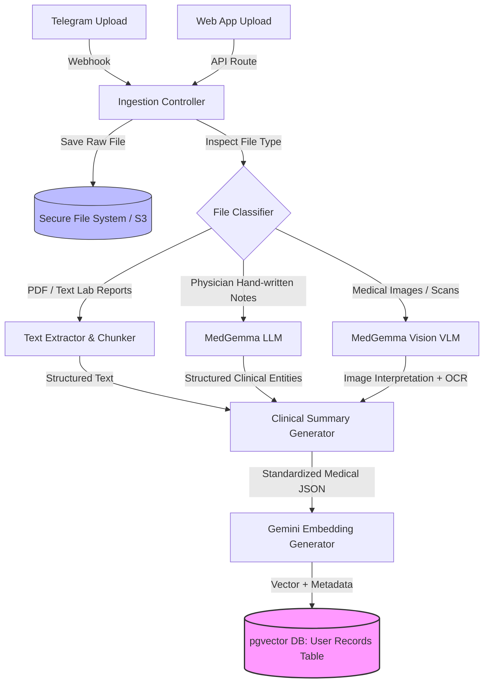
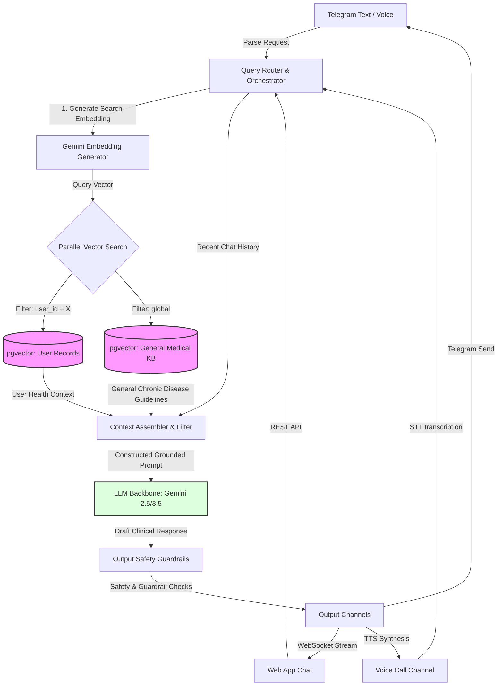

# Health Assistant with pgvector & Multimodal Ingestion
## Product Requirements Document (PRD) & Technical Pipeline Design

> [!NOTE]
> This document details the product strategy, technical architecture, data flow, and database designs for a HIPAA-compliant Health Assistant. The system ingests personal medical files (documents, images, lab reports) to build a private user health context while utilizing a general medical knowledge base for chronic disease education and queries.

---

## 1. Executive Summary & Vision

The Health Assistant is a personal healthcare companion that bridges the gap between unstructured, complex personal medical records (lab reports, physician notes, diagnostic images) and patients. 

### Core Value Propositions:
1. **Seamless Multimodal Ingestion**: Patients can upload documents (PDFs, images) directly via a Telegram bot, Web App, or dictate summaries via Voice.
2. **AI-Powered Medical Translation**: Uses **MedGemma** (specialized medical VLM/LLM) for processing medical images and physician notes, translating jargon into patient-understandable summaries, and generating precise embeddings.
3. **Dual RAG System**:
   - **Personal Health Vector Store**: Private, isolated, semantic index of the user's own medical history.
   - **General Medical Knowledge Base**: Public medical training data, research, guidelines, and chronic disease documentation.
4. **Multi-Channel Engagement**: Access via a Telegram Bot (authenticated via phone number), a premium responsive Web Application, and real-time Voice Interaction.

---

## 2. Product Requirements Document (PRD)

### 2.1 User Personas & Use Cases

* **Persona A: Chronic Patient (e.g., Diabetes/Hypertension)**
  - *Need*: Monitor lab values over time, ask questions about treatment plans, get advice on managing symptoms, and understand medication interactions.
  - *Interaction*: Primarily uses Telegram for quick queries/photo uploads of prescription sheets, and Web App for viewing trend charts.
* **Persona B: Caregiver**
  - *Need*: Upload discharge summaries and doctor notes for an elderly relative and retrieve summaries of care protocols.
  - *Interaction*: Uses Web App to batch-upload documents and review the consolidated health history.

### 2.2 Functional Requirements

#### FR-1: User Registration & Authentication (Telegram & Web)
- Users must register using their phone number via the Telegram Bot.
- Telegram Bot uses the `sendContact` prompt to securely verify the phone number.
- Web App authentication must link to the verified Telegram phone number using a secure One-Time Password (OTP) sent via Telegram.
- Session tokens (JWTs) secure all subsequent frontend API requests.

#### FR-2: Multimodal Ingestion Pipeline
- **Lab Reports & PDFs**: Extract text, parse tabular data (e.g., blood work panels), and chunk the contents.
- **Physician Notes**: Process via **MedGemma** to extract clinical entities, active medications, diagnoses, and allergies.
- **Medical Images (X-Rays, MRIs, Prescriptions)**: Pass to **MedGemma** (Vision) to extract structural descriptions and OCR text.
- **Embeddings**: Generate dense vectors using Gemini's text embedding model (`text-embedding-004`) for all parsed/structured records.

#### FR-3: Vector Storage & Segmentation
- **User-Specific Records**: Encrypted and stored in a user-segregated `pgvector` table (or partitioned table) indexed by `user_id` and verified phone number.
- **General Knowledge**: Stored in a separate global `pgvector` table containing chronic disease guidelines, drug facts, and medical literature.

#### FR-4: Contextual Querying & RAG Orchestration
- A query engine that searches across:
  1. The user's personal medical records database (semantic search restricted to the user's `user_id`).
  2. The general medical knowledge database (semantic search for chronic disease info, medical guidelines).
  3. Short-term conversation history.
- The retrieved contexts are formatted into a prompt for the backbone LLM (Gemini 2.5/3.5) with strict medical grounding constraints.

#### FR-5: User Interaction Channels
- **Telegram Bot**: Supports text messaging, file/image upload, and voice note transcription.
- **Web App**: Premium interface containing an ingestion dashboard, chronological medical timeline, lab test trend tracker, and an interactive chat window.
- **Voice Call**: Allows users to place a voice call (via Twilio/LiveKit integration) to speak directly with their health assistant.

### 2.3 Security, Privacy & Compliance

> [!CRITICAL]
> Medical data is subject to HIPAA and GDPR regulations. The system must implement rigid security standards.

1. **Data Encryption**: All data must be encrypted at rest (using AES-256) and in transit (TLS 1.3). User medical record tables should use column-level encryption or row-level security (RLS).
2. **Isolation**: A user must never be able to retrieve another user's vector embeddings. Queries must contain a hard parameter constraint: `WHERE user_id = :current_user_id`.
3. **PII Redaction**: When sending data to generic APIs, redact direct identifiers (Name, SSN) where possible, keeping only clinical context.

---

## 3. Technical Pipeline Architecture

The following diagram is the original ingestion pipeline design provided in the user sketch:


The following diagrams illustrate the formal ingestion and retrieval flows of the health assistant.

### 3.1 Data Ingestion Pipeline (From Files to pgvector)



### 3.2 Retrieval & Query Pipeline (RAG)



---

## 4. Database Schema (PostgreSQL + pgvector)

We utilize **pgvector** to enable vector database queries directly inside PostgreSQL. Below is the proposed SQL schema:

```sql
-- Enable the pgvector extension
CREATE EXTENSION IF NOT EXISTS vector;

-- 1. Users Table
CREATE TABLE users (
    id UUID PRIMARY KEY DEFAULT gen_random_uuid(),
    phone_number VARCHAR(20) UNIQUE NOT NULL,
    telegram_id VARCHAR(50) UNIQUE NULL,
    created_at TIMESTAMP WITH TIME ZONE DEFAULT CURRENT_TIMESTAMP,
    updated_at TIMESTAMP WITH TIME ZONE DEFAULT CURRENT_TIMESTAMP
);

-- 2. User Medical Records Metadata
CREATE TABLE user_medical_records (
    id UUID PRIMARY KEY DEFAULT gen_random_uuid(),
    user_id UUID REFERENCES users(id) ON DELETE CASCADE NOT NULL,
    file_name VARCHAR(255) NOT NULL,
    file_path VARCHAR(512) NOT NULL,  -- Path to secure storage
    file_type VARCHAR(50) NOT NULL,  -- e.g., 'pdf', 'jpeg', 'physician_note'
    extracted_summary TEXT,           -- The human-readable text summary from MedGemma
    created_at TIMESTAMP WITH TIME ZONE DEFAULT CURRENT_TIMESTAMP
);

-- 3. User Record Embeddings (pgvector)
-- Using 768 dimensions for gemini text-embedding-004
CREATE TABLE user_record_embeddings (
    id UUID PRIMARY KEY DEFAULT gen_random_uuid(),
    record_id UUID REFERENCES user_medical_records(id) ON DELETE CASCADE NOT NULL,
    user_id UUID REFERENCES users(id) ON DELETE CASCADE NOT NULL,
    chunk_index INT NOT NULL,
    chunk_content TEXT NOT NULL,
    embedding vector(768) NOT NULL,
    created_at TIMESTAMP WITH TIME ZONE DEFAULT CURRENT_TIMESTAMP
);

-- Create HNSW index for high performance vector similarity search on user database
-- Filter query will always include user_id index
CREATE INDEX idx_user_record_embeddings_vector 
ON user_record_embeddings 
USING hnsw (embedding vector_cosine_ops);

CREATE INDEX idx_user_record_embeddings_user_id 
ON user_record_embeddings(user_id);


-- 4. General Medical Knowledge Base
CREATE TABLE general_medical_knowledge (
    id UUID PRIMARY KEY DEFAULT gen_random_uuid(),
    disease_category VARCHAR(100) NOT NULL,  -- e.g. 'Diabetes', 'Hypertension', 'COPD'
    source_title VARCHAR(255) NOT NULL,      -- e.g. 'AHA Hypertension Guidelines 2025'
    chunk_content TEXT NOT NULL,
    embedding vector(768) NOT NULL,
    created_at TIMESTAMP WITH TIME ZONE DEFAULT CURRENT_TIMESTAMP
);

-- Create HNSW index for General Medical Knowledge
CREATE INDEX idx_general_kb_vector 
ON general_medical_knowledge 
USING hnsw (embedding vector_cosine_ops);
```

---

## 5. Channel Integration Details

### 5.1 Telegram Bot (Core Onboarding Channel)
* **Onboarding Flow**:
  1. User starts conversation (`/start`).
  2. Bot requests phone number sharing using a reply keyboard containing `request_contact = True`.
  3. Bot captures contact payload, verifies `telegram_id` and `phone_number`.
  4. User is registered. Bot responds with confirmation and instructions on how to upload documents.
* **Document Processing**:
  - User sends a document or image.
  - Bot downloads the file to the ingestion backend.
  - Bot responds: *"File received. Analyzing medical data..."*
  - File is processed asynchronously; once completed, bot notifies: *"Ingestion complete. I've updated your health profile with details from [FileName]."*

### 5.2 Responsive Web Application
* **Dashboard Features**:
  - **Health Profile Summary**: Overview of chronic conditions, active medications, and allergies.
  - **Timeline View**: Chronological list of uploaded medical records, clinical notes, and physician summaries.
  - **File Ingestor**: Drag-and-drop zone supporting PDFs, medical reports, and photo uploads.
  - **Metric Trends**: Historical visualization of lab values parsed from reports (e.g., HbA1c, Blood Pressure, Cholesterol).
  - **Chat Interface**: Fully grounded chat window querying user records and general medical guidelines.

### 5.3 Voice Call Integration (Direct Interactive Assistant)
- Built using **Twilio Voice Webhook** or **LiveKit WebRTC**.
- **Outbound/Inbound Voice flow**:
  1. User calls the system phone number.
  2. Voice stream is transcribed in real-time (Speech-to-Text).
  3. Transcription is processed via the RAG Pipeline (retrieving user records and chronic guidelines).
  4. Response is generated and streamed to Text-to-Speech (TTS), e.g., via ElevenLabs or Gemini Multimodal Live API.

---

## 6. Implementation & Development Phasing

### Phase 1: Ingestion & Vector Foundations (Backend)
- Setup Postgres database with `pgvector`.
- Build the ingestion service in Python/FastAPI.
- Integrate **Gemini Embedding** API.
- Implement **MedGemma** vision/text models for parsing medical notes/scans.

### Phase 2: Bot Integrations & User Auth
- Build the Telegram Bot backend (Aiogram or PyTelegramBotAPI).
- Integrate phone number registration flow.
- Set up secure Web App JWT authentication linked to verified phone numbers.

### Phase 3: RAG Core & LangGraph Orchestration
- Build semantic search queries for user records (segregated by `user_id`) and general chronic knowledge.
- Implement LangGraph workflow to route questions, retrieve relevant chunks, synthesize medical responses, and perform safety verification.

### Phase 4: Frontend Development
- Build the Next.js React frontend (Timeline, Chat, Metrics Dashboard).
- Implement file upload with drag-and-drop.
- Connect real-time WebSocket connection for chat streaming.

### Phase 5: Voice Channel
- Integrate Twilio or LiveKit for real-time voice-based health consultation.
- Perform end-to-end latency optimizations.
